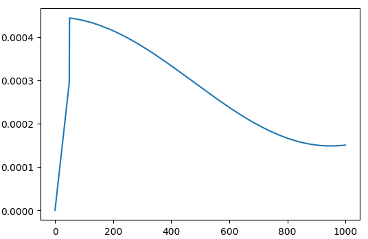
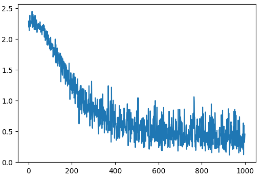
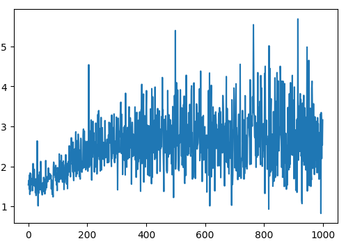
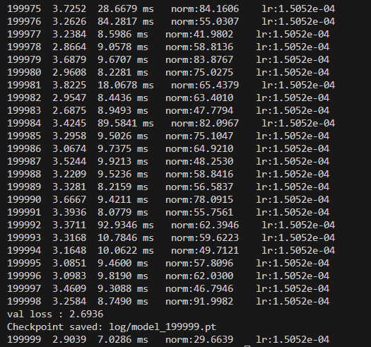
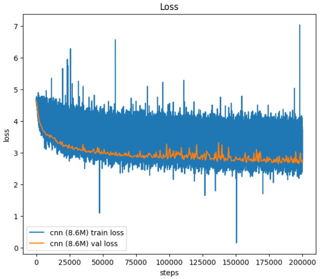

# miniVGG
Image classifier built from scratch with a VGG inspired architecture, including custom implementations of convolution, pooling, and fully connected layers.


## Progress


### Step 1 : vgg_v1

### Architecture : vgg_v1

```
Conv2D 5x5 -> ReLu -> MaxPool2D 3x3->
Conv2D 3x3 -> ReLu -> MaxPool2D 2x2->
MLP (Linear -> ReLu -> Projection)
```


**Training Configuration**
```
Max Iterations = 1000
Learning Rate  = 3e-4  

MNIST Dataset :
image size     = 28 x 28 
image channels = 1
```


<table>
  <tr>
    <td valign="top" width="50%">
      <h4>Training Results : Batch Size = 16</h4>
      <pre>
0/1000  2.310445547103882    10.44607162475586  ms
100/1000  2.21236515045166    6.488561630249023 ms
200/1000  1.666076898574829   6.346940994262695 ms
300/1000  1.0901288986206055  6.270408630371094 ms
400/1000  0.8322466611862183  7.765293121337891 ms
500/1000  0.7781930565834045  8.962154388427734 ms
600/1000  0.7698603868484497  8.695602416992188 ms
700/1000  0.5577788352966309  11.706829071044922 ms
800/1000  0.3392422795295715  6.481409072875977 ms
900/1000  0.7270603775978088  6.339788436889648 ms
Time for just one Iteration
      </pre>
    </td>
    <td valign="top" width="50%">
      <h4>Loss Curve</h4>
      
    </td>
  </tr>
</table>

**Validation accuracy**
```
0.8368 : Batch Size = 16
0.8507 : Batch Size = 32
0.8705 : Batch Size = 64 
```

---


### Step 2 : vgg_v2
- Added Batch Norm and Layer Norm to Model

### Architecture : vgg_v2

```
Conv2D 5x5 -> Batch Norm -> ReLu -> MaxPool2D 3x3->
Conv2D 3x3 -> Batch Norm -> ReLu -> MaxPool2D 2x2->
MLP (Layer Norm -> Linear -> ReLu -> Projection)
```


**Training Configuration**
```
Max Iterations = 1000
Learning Rate  = 3e-4  

MNIST Dataset :
image size     = 28 x 28 
image channels = 1
```


<table>
  <tr>
    <td valign="top" width="50%">
      <h4>Training Results : Batch Size = 16</h4>
      <pre>
0/1000  2.2896  46751.3280 ms
100/1000  1.8546  12.3034 ms
200/1000  1.4791  7.5624 ms
300/1000  1.0668  8.0299 ms
400/1000  1.0519  7.8294 ms
500/1000  0.4007  7.6325 ms
600/1000  0.5868  7.9434 ms
700/1000  0.3758  9.1152 ms
800/1000  0.3501  7.6864 ms
900/1000  0.5312  7.8576 ms
Time for just one Iteration
      </pre>
    </td>
    <td valign="top" width="50%">
      <h4>Loss Curve</h4>
      
    </td>
  </tr>
</table>

**Validation accuracy**
```
0.9031 : Batch Size = 16
0.9197 : Batch Size = 32
0.9309 : Batch Size = 64 
0.9370 : Batch Size = 128
```

---


### Step 3 : vgg_v3
- Training Techniques
- LR Schedule 
- Weight Decay : AdamW (decoupled Adam)
- Gradient Clipping

### Architecture : vgg_v3

```
Conv2D 5x5 -> Batch Norm -> ReLu -> MaxPool2D 3x3->
Conv2D 3x3 -> Batch Norm -> ReLu -> MaxPool2D 2x2->
MLP (Layer Norm -> Linear -> ReLu -> Projection -> Dropout)
```


**Training Configuration**
```
Max Iterations = 1000
Learning Rate  = 3e-4  

MNIST Dataset :
image size     = 28 x 28 
image channels = 1
```


<table>
  <tr>
    <td valign="top" width="50%">
      <h4>Training Results : Batch Size = 16</h4>
      <pre>
  0/1000  2.2896  16.0584 ms   norm:1.5367    lr:0.0000e+00
100/1000  1.8655   8.5244 ms   norm:1.8228    lr:4.3745e-04
200/1000  1.3525   8.6081 ms   norm:2.2887    lr:4.1419e-04
300/1000  0.9474  12.7351 ms   norm:2.9101    lr:3.7822e-04
400/1000  0.9315  14.9176 ms   norm:3.4945    lr:3.3345e-04
500/1000  0.3512   9.2251 ms   norm:1.9331    lr:2.8474e-04
600/1000  0.5896   8.6942 ms   norm:2.5713    lr:2.3735e-04
700/1000  0.3812   8.8377 ms   norm:2.4289    lr:1.9642e-04
800/1000  0.3488   8.3780 ms   norm:2.8563    lr:1.6640e-04
900/1000  0.5771   8.7245 ms   norm:3.6592    lr:1.5053e-04
Time for just one Iteration
      </pre>
      <h4>LR Schedule: Warm up + Cosine decay</h4>
      
    </td>
    <td valign="top" width="50%">
      <h4>Loss Curve</h4>
      
      <h4>Norms</h4>
      
    </td>
  </tr>
</table>

**Validation accuracy**
```
0.8947 : Batch Size = 16
```

---


### Step 4 : 
- change dir
- torch.compile

### Architecture : vgg_v3

```
Conv2D 5x5 -> Batch Norm -> ReLu -> MaxPool2D 4x4->
Conv2D 3x3 -> Batch Norm -> ReLu -> MaxPool2D 4x4->
MLP (Layer Norm -> Linear -> ReLu -> Projection -> Dropout)
```


**Training Configuration**
```
Max Iterations = 200000
Learning Rate  = max: 3e-4, min: 3e-6  

IMAGENET100 Dataset :
image size     = 224 x 224 
image channels = 3
batch size     = 32
```


<table>
  <tr>
    <td valign="top" width="50%">
      <h4>Training Results : Batch Size = 32</h4>
      
    </td>
    <td valign="top" width="50%">
      <h4>Loss Curve</h4>
      
    </td>
  </tr>
</table>

**Validation accuracy**
```
...
```

---